<h1 align="center">Hi, I'm William Callahan</h1>

  <strong>Software Engineer · Building AI/LLM, Data, and Search-Driven Products · Founder @ <a href="https://aVenture.vc">aVenture.vc</a>.</strong>

  
  
  
  

---

### Current Focus

- Building [aVenture.vc](https://aVenture.vc) – early-stage startup company research & intelligence platform  
- Improving multi-source enrichment agents for structured company + document profiles
- Iterating on hybrid web search + conversational reasoning ([search-ai.io](https://search-ai.io))
- Experimenting with a modern web application using AI to anticipate user needs ([Composer](https://composerai.app))

---

### Some of My Work

| Project | What It Is | Stack / Notes | Link |
|---------|------------|---------------|------|
| [aVenture](https://aVenture.vc) | Intelligence + diligence platform for venture research | Multi-service web app, enrichment agents | [aVenture.vc](https://aVenture.vc) |
| [aVenture: TUI Company Search](https://tui.aventure.vc) | Terminal-first research interface | Rich TUI, streaming updates | [tui.aventure.vc](https://tui.aventure.vc) |
| TUI4J | A modern terminal user interface library for Java | Java, Spring a port of BubbleTea from Go | [GitHub](https://github.com/WilliamAGH/tui4j) |
| [SearchAI](https://search-ai.io) | Perplexity-like retrieval + chat | RAG, SERP + crawler fusion | [GitHub](https://github.com/WilliamAGH/searchai-io) |
| [williamcallahan.com](https://williamcallahan.com) | Writing, background, bookmarks | Next.js, S3, TypeScript | [GitHub](https://github.com/WilliamAGH/williamcallahan.com) |
| [Composer](https://composerai.app) | AI-assisted email application | Java 25, Spring Boot 3.5, Svelte 5 | [GitHub](https://github.com/WilliamAGH/composerai) |
| Brief | A beautiful terminal user interface LLM client for AI chat with tool calls and model switching | Java 25 | [GitHub](https://github.com/WilliamAGH/brief)
| Repo Tokens Calculator | Quickly estimate token + embedding budgets for repos | Parsing + language-aware heuristics | [GitHub](https://github.com/WilliamAGH/repo-tokens-calculator) |
| [Filey: VS Code Extension](https://marketplace.visualstudio.com/items?itemName=WilliamCallahan.flag-deprecated-files) | Flags deprecated files in large workspaces | Developer experience tooling | [GitHub](https://github.com/WilliamAGH/vscode-flag-deprecated-files-extension) |
| [FindMyBook](https://findmybook.net) | Millions of books searchable with semantic + structured filters | Indexing + metadata normalization | [GitHub](https://github.com/WilliamAGH/findmybook) |

---

### Language & Stack Snapshot

  <picture>
    <source media="(prefers-color-scheme: dark)" srcset="assets/languages-dark.svg" />
    
  </picture>

**Core Toolbox:**  
`TypeScript / JavaScript` · `Java` · `Python` · `Node.js / Bun / Deno` · `React / Next.js / Svelte / SvelteKit` · `PostgreSQL / MySQL` · `Spring Boot` · `Vector Embeddings / Qdrant / pgvector` · `Playwright / Scraping` · `LLMs (OpenAI, Anthropic, Qwen, LLama, DeepSeek, etc.)`

---

### Agent / Retrieval Experiments

These days I'm doing a lot of work on:
- Multi-stage web crawling → parsing → enrichment data pipelines
- Hybrid retrieval (BM25 + dense + rerankers)
- Streaming data/UX patterns

If you're working on similar things, feel free to reach out! Especially if you're in SF.

---

### Background

I live in the United States. Grew up in a small town in Iowa, and am now living my dream of building tech in San Francisco. I post and share regularly at:  
- Personal writing: [williamcallahan.com](https://williamcallahan.com)  
- Live bookmarks feed: [williamcallahan.com/bookmarks](https://williamcallahan.com/bookmarks)
- Venture capital/angel investments: [williamcallahan.com/investments](https://williamcallahan.com/investments)

---

### Connect

DM on [X](https://x.com/williamcallahan) or connect on [LinkedIn](https://linkedin.com/in/williamacallahan).

---
